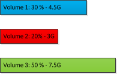
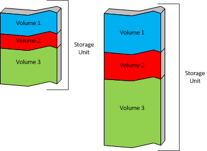
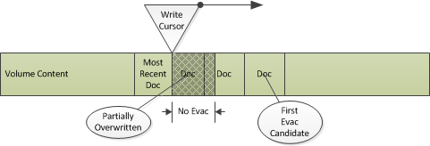
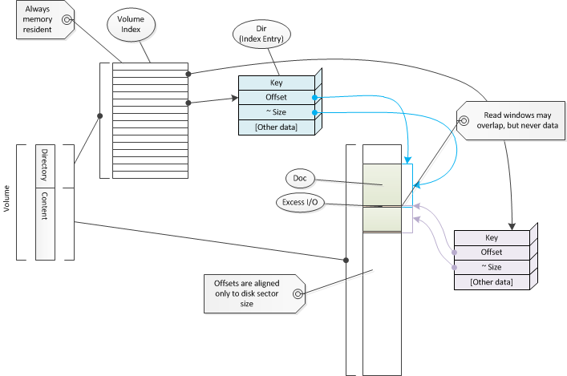

.. Licensed to the Apache Software Foundation (ASF) under one
   or more contributor license agreements.  See the NOTICE file
  distributed with this work for additional information
  regarding copyright ownership.  The ASF licenses this file
  to you under the Apache License, Version 2.0 (the
  "License"); you may not use this file except in compliance
  with the License.  You may obtain a copy of the License at
 
   http://www.apache.org/licenses/LICENSE-2.0
 
  Unless required by applicable law or agreed to in writing,
  software distributed under the License is distributed on an
  "AS IS" BASIS, WITHOUT WARRANTIES OR CONDITIONS OF ANY
  KIND, either express or implied.  See the License for the
  specific language governing permissions and limitations
  under the License.

キャッシュアーキテクチャ
***********************

.. include:: common.defs

導入
~~~~

HTTP プロキシに加え、 |ATS| は HTTP キャッシュでもあります。
|TS| は、現在サポートしているHTTPプロキシによって配信される
オクテットストリームのみなら、任意のオクテットストリームを
キャッシュできます。
そのようなストリームがキャッシュされる時、それは キャッシュ内で 
*オブジェクト* と命名されます。
コンテンツが取得されるサーバは、 *オリジンサーバ* と呼ばれます。
保存されたオブジェクトは、オクテットストリームコンテンツと
HTTPリクエスト・レスポンスヘッダを含みます。
各オブジェクトは *キャッシュキー* と呼ばれる大域的な固有の値により
識別されます。
デフォルトでは、オリジンサーバからコンテンツを取得するため、 
`MD5 ハッシュ <http://www.openssl.org/docs/crypto/md5.html>`_ 化
された URI が使用されます。

このドキュメントの目的は、 |TS| キャッシュの実装の詳細を提供する事です。
キャッシュの設定を議論するには、内部メカニズムを理解することが大いに
必要とされます。
このドキュメントは、主に |TS| のコードベースや |TS| のプラグイン で働く
|TS| デベロッパーにとって有用となるでしょう。
読者は、:ref:`admin-guide` と、特に :ref:`http-proxy-caching` と 
:ref:`configuring-the-cache` 加えて設定ファイルや設定値関連に
既に詳しいことが想定されます。

キャッシュレイアウト
~~~~~~~~~~~~~~~~~~~

キャッシュオペレーションの理解の初歩は、データ構造とキャッシュのレイアウトを
理解する事です。

キャッシュストレージ
===================

|TS| キャッシュのローストレージは、 :file:`storage.config` に設定されます。
この "ストレージユニット" の定義はキャッシュに使用されます。
ストレージユニットは区別されないバイト範囲として扱われます。

.. figure:: images/ats-cache-storage-units.png
   :align: center

   キャッシュストレージユニットの例

このストレージは、 :file:`volume.config` 内で *ボリューム* 定義に使用されます。
ボリュームはストレージの合計のパーセンテージ、もしくはストレージの絶対的な
容量として定義できます。
各ボリュームは、冗長化と性能のため、それぞれのストレージユニットに
それぞれ配置され、ストレージユニットを横断してストライプされます。

もし、以下のように例のストレージユニットのボリュームが定義されていたら

その時実際のレイアウトはこのように見えるでしょう。

キャッシュオブジェクトは、一つのボリュームと一つのストレージユニットに
全部が保存されます。
一つのオブジェクトを保持するストレージは、 *ドキュメント* と呼ばれます。
オブジェクトは、オリジンサーバからオブジェクトを取得するのに使用される
URI のハッシュ値に基づき、自動的にボリュームに割り当てられます。
特定のホストやドメインからのサポートされるコンテンツ を、
特定ボリュームに保存することは、:file:`hosting.config` の
限られた範囲で設定する事で可能です。

ボリューム構成
==============

ボリュームは区別されないバイト列の範囲として扱われます。
内部的に、各ストレージユニットの各ストライプは、ほとんど全体を独立して
扱われます。
このセクションのデータ構造の記述は、一つのストレージユニットに格納される
ボリュームの一部の各ボリュームストライプが重複されています。
これは、 コード内で "ボリューム" と :cpp:class:`Vol` が使用されることに
よるものです。
キャッシュのボリュームとしてのユーザの考えは、 :cpp:class:`CacheVol` が
少し使用されている中に保存されます。

.. index: write cursor
.. _write-cursor:

ボリュームの各ストレージユニットは、二つのエリア -- コンテントと
ディレクトリに分けられます。
ディレクトリエリアは、 :ref:`メモリ内ディレクトリ <volume-directory>` の
ディスクバックアップを管理する為に使用されます。
コンテントエリアは、実際のオブジェクトと最も最近キャッシュされた
ドキュメントを新たなドキュメントで上書きする循環バッファとして使用されます。
特に、キャッシュボリュームの内部では、どのオペレーティングシステムの
ファイル構造でもない表現をされます。
ボリュームの、新たなキャッシュデータの位置は、 *ライトカーソル* と呼ばれます。
これは、データがライトカーソルによって上書きされる場合、たとえ失効して
いなくても、オブジェクトは事実上、キャッシュから立ち退かせることを意味します。

   キャッシュ内のライトカーソルとドキュメント

.. index:: volume directory
.. _volume-directory:

オブジェクトを探すため、各ボリュームはボリューム内に全ての
ドキュメントのディレクトリを持ちます。
このディレクトリは、キャッシュミスがディスクI/Oを引き起こさないよう
メモリに常駐させ続けます。
この副作用は、キャッシュサイズが増やす(より多くのオブジェクトを
保存せずに)と、Traffic Server のメモリ使用量が増えることです。
各ドキュメントは少なくとも1ディレクトリエントリを消費します。
巨大なドキュメントでは、より多くのエントリを要求できます。
  
.. index:: cache key
.. _cache-key:

ディレクトリは、128ビットキーのハッシュテーブルです。
このキーの種類は、 *キャッシュキー* と呼ばれます。
オブジェクトのキャッシュキーは、ボリューム割当 [#]_ の後、相当するディレクトリ
エントリに配置するのに使用されます。
このエントリは、オブジェクトヘッダとオブジェクトをも含んだをボリュームコンテント
エリアの間隔を次に参照します。
ディレクトリエントリに保存されるサイズは、少なくともディスクの実際のデータと同じ
くらい大きい :ref:`おおよそのサイズ <dir-size>` です。
ディスク上のドキュメントヘッダは、全ドキュメントの正確なサイズとオブジェクトに
関連したHTTPヘッダを含むドキュメントの為のメタデータを含みます。

.. note:: HTTPヘッダのデータは、ディスクI/Oなしには検査できません。
  これは、メモリに格納されたデータ由来のキャッシュキーについてのみ、
  オブジェクトのオリジナルURLが含まれます。

永続性のため、ディレクトリはコピー(AとB)でディスク上に保存されます。
そのうち一つは"クリーン"で、他方はメモリから書かれます。
これらはボリュームのディレクトリセクションに保存されます。

   ボリュームディレクトリ構造

ディレクトリの合計サイズ(エントリの数)は、ボリュームのサイズを取得し、平均
オブジェクトサイズで除算することで計算されます。
もしキャッシュサイズが、 |TS| のためのメモリ要求がそうであるよう増加される場合、
ディレクトリは常に、その効果があるこのメモリ量を消費します。
平均オブジェクトサイズはデフォルトで8000バイトですが、 :file:`records.config` の
以下の値を使うことで設定できます。::

   proxy.config.cache.min_average_object_size

平均オブジェクトサイズを増加させることにより、キャッシュに保存する個別の
オブジェクトの数を減らす犠牲により、ディレクトリのメモリ使用量を減らせる
でしょう。[#]_

.. note:: ディスク上のキャッシュデータは永遠に更新されません。

これは心に留めておく重要な思考です。
更新されるように見えるもの（古くなったコンテンツをリフレッシュし、304を返す
ような）は、実際にはライトカーソルで書き込まれているデータの新しいコピーです。
オリジナルは、ライトカーソルがディスクのその位置に到着する時消費される、"死んだ"
スペースとして残されます。
一旦ボリュームディレクトリが（メモリ内で！）更新されると、キャッシュ上のオリジナル
オブジェクトは効率的に破棄されます。
これは他のケースで同様に用いられる、一般的なスペース管理技術です。
もしオブジェクトをキャッシュから削除することが必要になる場合、ボリュームディレク
トリエントリのみ変更されます。
他の動作を行う必要はありません。（そして、 *特に* ディスクI/Oもありません）

.. [#] 各ボリュームの各ストレージユニットが個別のディレクトリを持つので、割当は
       ディレクトリの探索の前に行われなければなりません。

.. [#] 興味深い潜在的な最適化は、キャッシュボリューム毎の平均オブジェクトサイズを
       設定することでしょう。

オブジェクト構造
================

オブジェクトは二つのデータのタイプ、メタデータとコンテントデータとして保存されます。
メタデータは、HTTPヘッダを含む、オブジェクトとコンテントに関する全てのデータです。
コンテントデータはオブジェクトのコンテントで、オブジェクトとしてクライアントに
配信される実際のデータです。

オブジェクトは、キャッシュに格納される :cpp:class:Doc 構造のルートです。
これは "first ``Doc``" と呼ばれ、常にメタデータに含まれます。
それは、任意のオブジェクトにより常に最初にアクセスされます。
この ``Doc`` は、場所と ``Doc`` の正確なサイズを指定したボリュームディレクトリの
対応するキャッシュキーにより配置されます。

.. index:: alternate

|TS| は オブジェクト用に `コンテントの検証 
<http://www.w3.org/Protocols/rfc2616/rfc2616-sec14.html#sec14.44>`_
をサポートします。
これらを *オルタネイツ* と呼びます。
全てのオルタネイツの全てのメタデータは、オルタネイツのセットとそれらの
HTTPヘッダを含むファースト ``Doc`` に格納されます。
これは、ディスクからの初期読み込み後に、`オルタネイトセクション <http://trafficserver.apache.org/docs/trunk/sdk/http-hooks-and-transactions/http-alternate-selection.en.html>`_ が実行され有効になります。
一個以上のオルタネイトを持つオブジェクトは、最初の ``Doc`` とは別に保存された
オルタネイトコンテントを持ちます。
一つのオルタネイトのみ持つオブジェクトについては、コンテントはメタデータとしての
(最初の)フラグメントと同じになるかもしれないし、そうでもないかもしれません。
個々の分離されたオルタネイトコンテントは、ボリュームディレクトリエントリに
割り当てられ、エントリーのキーは最初の ``Doc`` メタデータに保存されます。

バージョン 3.2.0 以前は、ヘッダデータは 可変長のディスクイメージの領域をまとめる
:cpp:class:`CacheHTTPInfoVector` クラス内に保存されていました。

.. figure:: images/ats-cache-doc-layout-pre-3-2-0.png
   :align: center

   3.2.0 以前の ``Doc`` レイアウト

これは、一つのフラグメントテーブルのみで、一つ以上のオルタネイト [#]_
を持つオブジェクトに対して正確な信頼性を持てない問題があります。
従って、以下の形式のレイアウトになるよう、フラグメントデータはメタデータの個別の
可変長セクションから、 :cpp:class:`CacheHTTPInfoVector` へ直接統合されるよう
移動されました。

.. figure:: images/ats-cache-doc-layout.png
   :align: center

   3.2.0 の ``Doc`` レイアウト

ベクターの各要素は、各オルタネイトに加え、HTTPヘッダと(もしあれば)フラグメント
テーブル、キャッシュキーを含みます。
このキャッシュキーは "最初期の ``Doc`` " として参照されるボリュームディレクトリ
エントリを識別します。
これはオルタネイトのコンテントが始まる位置です。

オブジェクトが最初にキャッシュされたとき、それは単一のオルタネイトを持ち、(大き
すぎない場合は)最初の ``Doc`` に格納されるでしょう。
これはコード中で *レジデントオルタネイト* と名付けられます。
レジデントオルタネイトは好ましく無く、今度はオブジェクトコンテントが分離される
ようヘッダ情報が更新されます。

.. note:: :cpp:class:`CacheHTTPInfoVector` は最初の ``Doc`` にのみ保存されます。
   その後の ``Doc`` インスタンスは、ゼロの ``hlen`` を持つでしょう

巨大なオブジェクトは、キャッシュに書き込まれる時に *フラグメント*
に分割されます。
各フラグメントはボリュームディレクトリの自身のエントリを持ちます。
これはドキュメント長の合計が、最初の ``Doc`` もしくは最初期の ``Doc``
のコンテントより長いことを示します。
これは、(最初のオフセットが常にゼロである)過去に最初だった各フラグメント毎の
コンテントデータの、最初のバイトのオブジェクトコンテント内の、
バイトオフセットを含みます。
これは、中間のフラグメントが、最初/最初期 ``Doc`` の次にロードされた関連データを
伴う最初のフラグメントをスキップできることにより、巨大なオブジェクトの為に非常に
効率的に提供されるためのレンジリクエスト許可します。
シーケンスの最後のフラグメントは、フラグメントサイズとオフセットがオブジェクトの
合計サイズの最後に到達することにより検出されます。
明示的なエンドマークはありません。
各フラグメントは計算上は前のものと繋がっています。
フラグメントNのキャッシュキーは、以下により計算されます::

   key_for_N_plus_one = next_key(key_for_N);

``next_key`` の部分は、既存のキャッシュキーから新しいキャッシュキーを決定論的に
計算する帯域関数です。

複数のフラグメントを伴うオブジェクトは、(最初期の ``Doc`` を含む)最初に
書き込まれたデータフラグメントと最後に書き込まれた最初の ``Doc`` のように、
レイアウトされます。
ディスクから読み込まれる時、最初と最初期の ``Doc``
の両方は、全体のドキュメントがディスクに存在することを確認する(それら、他の
フラグメントのブックエンドとして、ライトカーソルは確認された ``Doc`` インスタンス
の少なくとも一つの上書き無しに、それらを上書き出来ません)ため、(それらが
ライトカーソルにより上書きされていない確認することにより試験されます)検証されます。
単一のオブジェクトのフラグメントは、異なるオブジェクトが |TS| に届いたデータ
として綴じ込められたデータとして、必然的に隣接しないよう整列されることに注意
してください。

.. index:: pinned

キャッシュへ "ピン留め" されるオブジェクトは、上書きされてはいけません。
そのため、それらは ライトカーソルの前に"退避" させられます
各フラグメントは読み込まれ、再書込みされます。
潜在的に信頼性の低いディスク領域ではなく、メモリ内で発見できるよう、退避される
オブジェクトのための特別な検出メカニズムがあります。
ピン留めされたオブジェクトを発見するため、キャッシュはライトカーソルより前にスキャンされます。
データを退避させることができないライトカーソル直前のデットゾーンがあります。
退避されたデータはディスクから読み込まれ、書込みキューに置かれ、出番が来ると
書き込まれます。

オブジェクトは、:file:`cache.config` ファイルを経て、以下の値をゼロでない値
(デフォルトではゼロ)に設定した場合のみピン留めできます。::

   proxy.config.cache.permit.pinning

ライトカーソルが近い時に使用されるオブジェクトは、しかし
:cpp:class:`Dir` の明示的な ``pinned`` ビット を経ずに自動的に処理されず、同じ
潜在的な退避メカニズムを使用します。

.. [#] それは、ある状況下では、オルタネイト無しに正確になりえます。

追加情報
========

データ構造のいくつかの概説。

循環バッファ
------------

キャッシュが循環であるため、キャッシュオブジェクトは不定期間の保存はされません。
たとえオブジェクトが古くなくても、そのボリュームのキャッシュサイクルとして
上書き出来ます。
``ピン留め`` としてオブジェクトをマーキングすることにより、ライトカーソルの通過を
やり過ごし、しかしキャッシュ内で再保存をする効果によりギャップを埋めて、コピー
することによりこれが処理され、オブジェクトを保存します。
巨大なオブジェクトや大量のオブジェクトのピン留めは、過度のディスク動作を引き
起こす場合があります。
ピン留めの本来の目的は、頻繁に使用されるオブジェクトを管理者により明記的に
印付け、それを小さくすることだと思われます。

これは、オブジェクトの失効データがクライアントに提供されるのをを単に防ぐのが
目的であることを意味します。
それらは標準の感覚では削除されたかクリーンアップされていません。
書込みはライトカーソルでのみ発生するので、どんなイベントにおいてもスペースは
直ちには取り戻されません。
オブジェクトの削除は、(結局)スペースを解放し、かつドキュメントをアクセス不可能に
するのに十分であるボリュームディレクトリのディレクトリエントリの削除からのみ
成り立ちます。

歴史的に、ウェブコンテンツは比較的小さく、特に一貫していなかったので、キャッシュは
この手段で設計されます。
この設計は高性能かつ低い一貫性の要求も提供します。
ストレージのフラグメンテーション問題は無く、またキャッシュミスやオブジェクト
削除はディスクI/Oを要求しません。
それは巨大なオブジェクトの長期間保存は特に扱いません。
この分野の幾つかの働きの詳細の付録 :ref:`volume tagging` を見てください。

ディスク障害
------------

キャッシュは、ディスク障害に比較的強いように設計されます。
各ボリュームの各ストレージユニットはほとんど独立しているので、ディスクの損失は 
対応する :cpp:class:`Vol` インスタンス(ストレージユニットを使うキャッシュ
ボリューム毎のそれ)が使えなくなることを単に意味します。
主な問題は、まだ運用中のボリューム上のオブジェクトのため、故障したディスクから
それらの運用中のボリューム割当の配布中に割当を両方保存するためのボリューム割当
テーブルの更新です。
これはほとんどこれで処理されます::

   AIO_Callback_handler::handle_disk_failure

現役動作中のディスクにリストアするのは、かなり困難な作業です。
キャッシュキーのボリューム割当の変更は、現在のどのキャッシュデータもアクセス
不可能にします。
これは当然ながらディスクが故障した時の問題ではありませんが、新しいストレージ
ユニットが動作中のシステムに追加された場合は、どのキャッシュされたオブジェクトが
事実上追い出されるか決定するため少々扱いにくいです。
このためのメカニズムは、もし何かあれば、まだ調査下にあります。

実装の詳細
==========

ボリュームディレクトリ
---------------------

.. _directory-entry:

The in memory volume directory entries are defined as described below.

.. cpp:class:: Dir

   Defined in |P-CacheDir.h|_.

   =========== =================== ===================================================
   Name        Type                Use
   =========== =================== ===================================================
   offset      unsigned int:24     Offset of first byte of metadata (volume relative)
   big         unsigned in:2       Offset multiplier
   size        unsigned int:6      Size
   tag         unsigned int:12     Partial key (fast collision check)
   phase       unsigned int:1      Unknown
   head        unsigned int:1      Flag: first segment in a document
   pinned      unsigned int:1      Flag: document is pinned
   token       unsigned int:1      Flag: Unknown
   next        unsigned int:16     Segment local index of next entry.
   offset_high inku16              High order offset bits
   =========== =================== ===================================================

   The volume directory is an array of ``Dir`` instances. Each entry refers to a span in the volume which contains a cached object. Because every object in the cache has at least one directory entry this data has been made as small as possible.

   The offset value is the starting byte of the object in the volume. It is 40 bits long split between the *offset* (lower 24 bits) and *offset_high* (upper 16 bits) members. Note that since there is a directory for every storage unit in a cache volume, this is the offset in to the slice of a storage unit attached to that volume.

.. _dir-size:

   The *size* and *big* values are used to calculate the approximate size of the span which contains the object. This value is used as the number of bytes to read from storage at the offset value. The exact size is contained in the object metadata in :cpp:class:`Doc` which is consulted once the read has completed. For this reason the approximate size needs to be at least as large as the actual size but can be larger, at the cost of reading the extraneous bytes.

   The computation of the approximate size of the fragment is defined as::

      ( *size* + 1 ) * 2 ^ ( ``CACHE_BLOCK_SHIFT`` + 3 * *big* )

   where ``CACHE_BLOCK_SHIFT`` is the bit width of the size of a basic cache block (9, corresponding to a sector size of 512). Therefore the value with current defines is::

      ( *size* + 1 ) * 2 ^ (9 + 3 * *big*)

   Because *big* is 2 bits the values for the multiplier of *size* are

   .. _big-mult:

   ===== ===============   ===============
   *big* Multiplier        Maximum Size
   ===== ===============   ===============
     0   512 (2^9)         32768 (2^15)
     1   4096 (2^12)       262144 (2^18)
     2   32768 (2^15)      2097152 (2^21)
     3   262144 (2^18)     16777216 (2^24)
   ===== ===============   ===============

   Note also that *size* is effectively offset by one, so a value of 0 indicates a single unit of the multiplier.

.. _target-fragment-size:

The target fragment size can set with the :file:`records.config` value

   ``proxy.config.cache.target_fragment_size``

This value should be chosen so that it is a multiple of a :ref:`cache entry multiplier <big-mult>`. It is not necessary to make it a power of 2 [#]_. Larger fragments increase I/O efficiency but lead to more wasted space. The default size (1M, 2^20) is a reasonable choice in most circumstances altough in very specific cases there can be benefit from tuning this parameter. |TS| imposes an internal maximum of a 4194232 bytes which is 4M (2^22) less the size of a struct :cpp:class:`Doc`. In practice then the largest reasonable target fragment size is 4M - 262144 = 3932160.

When a fragment is stored to disk the size data in the cache index entry is set to the finest granularity permitted by the size of the fragment. To determine this consult the :ref:`cache entry multipler <big-mult>` table, find the smallest maximum size that is at least as large as the fragment. That will indicate the value of *big* selected and therefore the granularity of the approximate size. That represents the largest possible amount of wasted disk I/O when the fragment is read from disk.

.. note:: The cache index entry size is used only for reading the fragment from disk. The actual size on disk, and the amount of cache space consumed, is the actual size of the content rounded up to the disk sector size (default 512 bytes).

.. index:: DIR_DEPTH, index segment, index buckets

The set of index entries for a volume are grouped in to *segments*. The number of segments for an index is selected so that there are as few segments as possible such that no segment has more than 2^16 entries.  Intra-segment references can therefore use a 16 bit value to refer to any other entry in the segment.

Index entries in a segment are grouped *buckets* each of ``DIR_DEPTH`` (currently 4) entries. These are handled in the standard hash table way, giving somewhat less than 2^14 buckets per segment.

オブジェクトメタデータ
---------------------

The metadata for an object is stored in a :cpp:class:`Doc`.

.. [#] The comment in :file:`records.config` is simply wrong.

--------------
キャッシュ命令
--------------

Cache activity starts after the HTTP request header has been parsed and remapped. Tunneled transactions do not interact with the cache because the headers are never parsed.

To understand the logic we must introduce the term "cache valid" which means something that is directly related to an object that is valid to be put in the cache (e.g. a ``DELETE`` which refers to a URL that is cache valid but cannot be cached itself). This is important because |TS| computes cache validity several times during a transaction and only performs cache operations for cache valid results. The criteria used changes during the course of the transaction as well. This is done to avoid the cost of cache activity for objects that cannot be in the cache.

The three basic cache operations are lookup, read, and write. We will take deleting entries as a special case of writing where only the volume directory is updated.

After the client request header is parsed and is determined to be potentially cacheable, a `cache lookup`_ is done. If successful a `cache read`_ is attempted. If either the lookup or the read fails and the content is considered cacheable then a `cache write`_ is attempted.

キャッシャビリティ
=================

The first thing done with a request with respect to cache is to determine whether it is potentially a valid object for the cache. After initial parsing and remapping this check is done primarily to detect a negative result because if so all further cache processing is skipped -- it will not be put in to the cache nor will a cache lookup be done. There are a number of prerequisites along with configuration options to change them. Additional cacheability checks are done later in the process when more is known about the transaction (such as plugin operations and the origin server response). Those checks are described as appropriate in the sections on the relevant operations.

The set of things which can affect cacheability are

* Built in constraints
* Settings in :file:`records.config`
* Settings in :file:`cache.config`
* Plugin operations

The initial internal checks, along with their :file:`records.config` overrides[#]_, are done in::

   HttpTransact::is_request_cache_lookupable

The checks that are done are

   Cacheable Method
      The request must be one of ``GET``, ``HEAD``, ``POST``, ``DELETE``, ``PUT``.

      See ``HttpTransact::is_method_cache_lookupable()``.

   Dynamic URL
      |TS| tries to avoid caching dynamic content because it's dynamic. A URL is considered dynamic if it

      *  is not ``HTTP`` or ``HTTPS``
      *  has query parameters
      *  ends in ``asp``
      *  has ``cgi`` in the path

      This check can be disabled by setting a non-zero value for::

         proxy.config.http.cache.cache_urls_that_look_dynamic

      In addition if a TTL is set for rule that matches in :file:`cache.config` then this check is not done.

   Range Request
      Cache valid only if :ts:cv:`proxy.config.http.cache.range.lookup` in :file:`records.config` is non-zero. This does not mean the range request can be cached, only that it might be satisfiable from the cache.

A plugin can call :c:func:`TSHttpTxnReqCacheableSet()` to force the request to be viewed as cache valid.

.. [#] The code appears to check :file:`cache.config` in this logic by setting the ``does_config_permit_lookup`` in the ``cache_info.directives`` of the state machine instance but I can find no place where the value is used. The directive ``does_config_permit_storing`` is set and later checked so the directive (from the administrator point of view) is effective in preventing caching of the object.

キャッシュの探索
===============

If the initial request is not determined to be cache invalid then a lookup is done. Cache lookup determines if an object is in the cache and if so, where it is located. In some cases the lookup proceeds to read the first ``Doc`` from disk to verify the object is still present in the cache.

There are three basic steps to a cache lookup.

#. The cache key is computed.

   This is normally computed using the request URL but it can be overridden :ref:`by a plugin <cache-key>` . As far as I can tell the cache index string is not stored anywhere, it presumed computable from the client request header.

#. The cache volume is determined (based on the cache key).

   The cache key is used as a hash key in to an array of :cpp:class:`Vol` instances. The construction and arrangement of this array is the essence of how volumes are assigned.

#. The cache volume directory is probed using the index key computed from the cache key.

   Various other lookaside directories are checked as well, such as the :ref:`aggregation buffer <aggregation-buffer>`.

#. If the directory entry is found the first ``Doc`` is read from disk and checked for validity.

   This is done in :cpp:func:`CacheVC::openReadStartHead()` or :cpp:func:`CacheVC::openReadStartEarliest()` which are tightly coupled methods.

If the lookup succeeds then a more detailed directory entry (struct :cpp:class:`OpenDir`) is created. Note that the directory probe includes a check for an already extant ``OpenDir`` which if found is returned without additional work.

キャッシュリード
===============

Cache read starts after a successful `cache lookup`_. At this point the first ``Doc`` has been loaded in to memory and can be consulted for additional information. This will always contain the HTTP headers for all alternates of the object.

.. sidebar:: Read while write

   There is provision in the code to support "read while write", that is serving an object from cache in one transaction while it is being written in another. It is unclear to me if this actually works. It must specifically enabled in :file:`records.config` and if not, a cache read will fail if the object is currently be written or updated.

At this point an alternate for the object is selected. This is done by comparing the client request to the stored response headers, but it can be controlled by a plugin using ``TS_HTTP_ALT_SELECT_HOOK``.

The content can now be checked to see if it is stale by calculating the "freshness" of the object. This is essential checking how old the object is by looking at the headers and possibly other metadata (note the headers can't be checked until we've selected an alternate).

Most of this work is done in::

   HttpTransact::what_is_document_freshness

First the TTL (time to live) value which can be set in:file:`cache.config` is checked if the request matches the configuration file line. This is done based on when the object was placed in cache, not on any data in the headers.

Next an internal flag ("needs-revalidate-once") is checked if the :file:`cache.config` value "revalidate-after" is not set, and if set the object is marked "stale".

After these checks the object age is calculated by::

   HttpTransactHeaders::calculate_document_age

and then any configured fuzzing is applied. The limits to this age based on available data is calculated by::

   HttpTransact::calculate_document_freshness_limit

How this age is used is determined by the :file:`records.config` value::

   proxy.config.http.cache.when_to_revalidate

If this is zero then the built caclulations are used which compare the freshness limits with document age, modified by any of the client supplied cache control values ``max-age``, ``min-fresh``, ``max-stale`` unless explicitly overridden in :file:`cache.config`.

If the object is not stale then it is served to the client. If stale the client request may be changed to an ``If Modified Since`` request to revalidate.

The request is served using a standard virtual connection tunnel (``HttpTunnel``) with the :cpp:class:`CacheVC` acting as the producer and the client ``NetVC`` acting as the sink. If the request is a range request this can be modified with a transform to select the appropriate parts of the object or, if the request contains a single range, it can use the range acceleration.

Range acceleration is done by consulting a fragment offset table attached to the earliest ``Doc`` which contains offsets for all fragments past the first. This allows loading the fragment containing the first requested byte immediately rather than performing reads on the intermediate fragments.

キャッシュライト
===============

Writing to cache is handled by an instance of the class :cpp:class:`CacheVC`. This is a virtual connection which receives data and writes it to cache, acting as a sink. For a standard transaction data transfers between virtual connections (*VConns*) are handled by :ccp:class:HttpTunnel. Writing to cache is done by attaching a ``CacheVC`` instance as a tunnel consumer. It therefore operates in parallel with the virtual connection that transfers data to the client. The data does not flow to the cache and then to the client, it is split and goes both directions in parallel. This avoids any data synchronization issues between the two.

.. sidebar:: Writing to disk

   The actual write to disk is handled in a separate thread dedicated to I/O operations, the AIO threads. The cache logic marshals the data and then hands the operation off to the AIO thread which signals back once the operation completes.

While each ``CacheVC`` handles its transactions independently, they do interact at the volume level as each ``CacheVC`` makes calls to the volume object to write its data to the volume content. The ``CacheVC`` accumulates data internally until either the transaction is complete or the amount of data to write exceeds the target fragment size. In the former case the entire object is submitted to the volume to be written. In the latter case a target fragment size amount of data is submitted and the ``CacheVC`` continues to operate on subsequent data. The volume in turn places these write requests in an holding area called the `aggregation buffer`_.

For objects under the target fragment size there is no consideration of order, the object is simply written to the volume content. For larger objects the earliest ``Doc`` is written first and the first ``Doc`` written last. This provides some detection ability should the object be overwritten. Because of the nature of the write cursor no fragment after the first fragment (in the earliest ``Doc``) can be overwritten without also overwriting that first fragment (since we know at the time the object was finalized in the cache the write cursor was at the position of the first ``Doc``).

.. note:: It is the responsibility of the ``CacheVC`` to not submit writes that exceed the target fragment size.

.. how does the write logic know if it's an original object write or an update to an existing object?

更新
----

Cache write also covers the case where an existing object in the cache is modified. This occurs when

* A conditional request is made to the origin server and a ``304 - Not Modified`` response is received.
* An alternate of the object is retrieved from an origin server and added to the object.
* An alternate of the object is removed (e.g., due to a ``DELETE`` request).

In every case the metadata for the object must be modified. Because |TS| never updates data already in the cache this means the first ``Doc`` will be written to the cache again and the volume directory entry updated. Because a client request has already been processed the first ``Doc`` has been read from cache and is in memory. The alternate vector is updated as appropriate (an entry added or removed, or changed to contain the new HTTP headers), and then written to disk. It is possible for multiple alternates to be updated by different ``CacheVC`` instances at the same time. The only contention is the first ``Doc``, the rest of the data for each alternate is completely independent.

.. _aggregation-buffer:

集約バッファ
------------

Disk writes to cache are handled through an *aggregation buffer*. There is one for each :cpp:class:`Vol` instance.
To minimize the number of system calls data is written to disk in units of roughly :ref:`target fragment size <target-fragment-size>` bytes. The algorithm used is simple - data is piled up in the aggregation buffer until no more will fit without going over the targer fragment size, at which point the buffer is written to disk and the volume directory entries for objects with data in the buffer are updated with the actual disk locations for those objects (which are determined by the write to disk action). After the buffer is written it is cleared and process repeats. There is a special lookup table for the aggregation buffer so that object lookup can find cache data in that memory.

Because data in the aggregation buffer is visible to other parts of the cache, particularly `cache lookup`_, there is no need to push a partial filled aggregation buffer to disk. In effect any such data is effectively memory cached until enough additional cache content arrives to fill the buffer.

The target fragment size has little effect on small objects because the fragment sized is used only to parcel out disk write operations. For larger objects the effect very significant as it causes those objects to be broken up in to fragments at different locations on in the volume. Each fragment write has its own entry in the volume directory which are computational chained (each cache key is computed from the previous one). If possible a fragment table is accumulated in the earliest ``Doc`` which has the offsets of the first byte for each fragment.

退避
----

By default the write cursor will overwrite (de facto evict from cache) objects as it proceeds once it has gone around the volume content at least once. In some cases this is not acceptable and the object is *evacuated* by reading it from the cache and then writing it back to cache which moves the physical storage of the object from in front of the write cursor to behind the write cursor. Objects that are evacuated are those that are active in either a read or write operation, or objects that are pinned [#]_.

Evacuation starts by dividing up the volume content in to a set of regions of ``EVACUATION_BUCKET_SIZE`` bytes. The :cpp:member:`Vol::evacuate` member is an array with an element for each region. Each element is a doubly linked list of :cpp:class:`EvacuationBlock` instances. Each instance contains a :cpp:class:`Dir` that specifies the document to evacuate. Objects to be evacuated are descrinbed in an ``EvacuationBlock`` which is put in to an evacuation bucket based on the offset of the storage location.

There are two types of evacuations, reader based and forced. The ``EvacuationBlock`` has a reader count to track this. If the reader count is zero, then it is a forced evacuation and the the target, if it exists, will be evacuated when the write cursor gets close. If the reader value is non-zero then it is a count of entities that are currently expecting to be able to read the object. Readers increment the count when they require read access to the object, or create the ``EvacuationBlock`` with a count of 1. When a reader is finished with the object it decrements the count and removes the ``EvacuationBlock`` if the count goes to zero. If the ``EvacuationBlock`` already exists with a count of zero, the count is not modified and the number of readers is not tracked, so the evacuation be valid as long as the object exists.

Objects are evacuated as the write cursor approaches. The volume calculates the current amount of

Before doing a write, the method :cpp:func:`Vol::evac_range()` is called to start an evacuation. If an eva

.. [#] `Work is under way <https://issues.apache.org/jira/browse/TS-2020>`_ on extending this to include objects that are in the ram cache.
