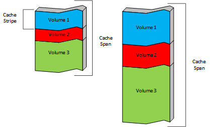
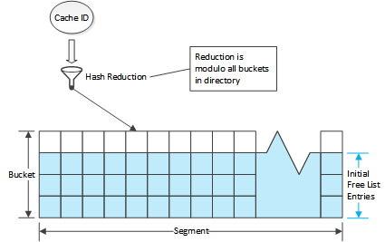
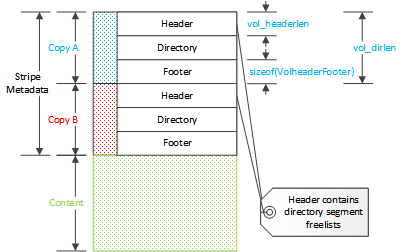
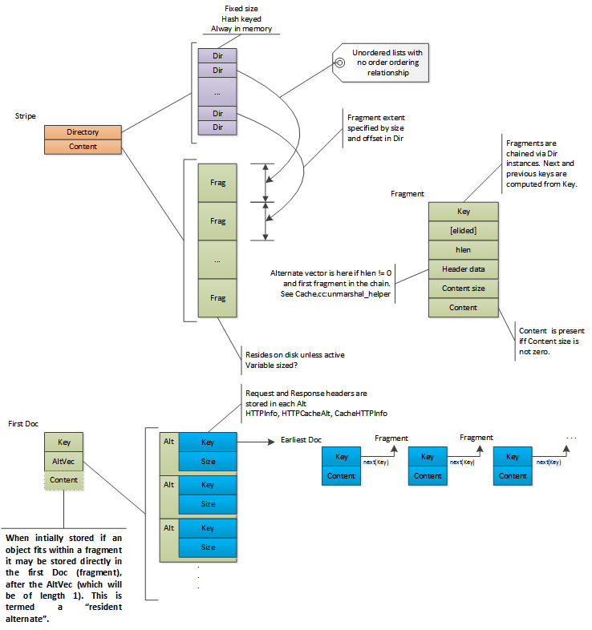

.. Licensed to the Apache Software Foundation (ASF) under one
   or more contributor license agreements.  See the NOTICE file
  distributed with this work for additional information
  regarding copyright ownership.  The ASF licenses this file
  to you under the Apache License, Version 2.0 (the
  "License"); you may not use this file except in compliance
  with the License.  You may obtain a copy of the License at
 
   http://www.apache.org/licenses/LICENSE-2.0
 
  Unless required by applicable law or agreed to in writing,
  software distributed under the License is distributed on an
  "AS IS" BASIS, WITHOUT WARRANTIES OR CONDITIONS OF ANY
  KIND, either express or implied.  See the License for the
  specific language governing permissions and limitations
  under the License.

キャッシュアーキテクチャ
***********************

.. include:: common.defs

導入
~~~~

HTTP プロキシに加え、 |ATS| は HTTP キャッシュでもあります。
|TS| は、現在サポートしているHTTPプロキシによって配信される
オクテットストリームのみなら、任意のオクテットストリームを
キャッシュできます。
そのようなストリームがキャッシュされる時、それは キャッシュ内で 
*オブジェクト* と命名されます。
各オブジェクトは *キャッシュキー* と呼ばれる大域的な一意の値により識別されます。
デフォルトではこの値は、オリジンサーバからコンテンツを取得するために使われるURIの 
`MD5 ハッシュ <http://www.openssl.org/docs/crypto/md5.html>`_ をとることで
生成されます。

このドキュメントの目的は、 |TS| キャッシュの基本構造と実装の詳細について記述する
ことです。
キャッシュの設定については、内部の仕組みを理解するのに必要な範囲でのみ述べられます。
このドキュメントは、主に |TS| のコードベースや |TS| のプラグインで働く
|TS| デベロッパーにとって有用となるでしょう。
読者は、:ref:`admin-guide` と、特に :ref:`http-proxy-caching` と 
:ref:`configuring-the-cache` 加えて設定ファイルや設定値関連に
既に詳しいことが想定されます。

不幸なことに、内部用語は特に一貫していません。
従って、このドキュメントは一貫性を得るため、コード内で使われるそれらとは違う表現で
頻繁に用語を使用するでしょう。

キャッシュレイアウト
~~~~~~~~~~~~~~~~~~~

キャッシュオペレーションを理解する最初のステップは、データ構造とキャッシュの
レイアウトを理解する事です。

キャッシュストレージ
===================

|TS| キャッシュの生のストレージは、 :file:`storage.config` に設定されます。

ファイルの各行は、未分化なストレージのユニットとして扱われる :term:`キャッシュ
スパン` を定義します。

.. figure:: images/cache-spans.png
   :align: center

   二つのキャッシュスパン

このストレージは、 :file:`volume.config` 内で定義される :term:`キャッシュ
ボリューム` のセットに組織されます。
キャッシュボリュームは、ストレージの合計またはストレージの絶対量のパーセンテージで
定義出来ます。
デフォルトでは、各キャッシュボリュームは堅牢性のためにキャッシュスパンの全てに
広げられます。
キャッシュボリュームとキャッシュスパンの交わるところは、
:term:`キャッシュストライプ` です。
各キャッシュスパンはキャッシュストライプに分割され、各キャッシュボリュームは
それらストライプのコレクションです。

もし、例のキャッシュスパンのキャッシュボリュームが以下のように定義されていたら

その時実際のレイアウトはこのように見えるでしょう。

キャッシュオブジェクトは、一つのストライプに全部が保存され、従って一つのキャッシュ
スパン、オブジェクトは永続的にキャッシュボリュームを横断して分離されます。
オブジェクトはキャッシュボリュームを横断して分離されることはありません。
オブジェクトは、オリジンサーバからオブジェクトを取得するのに使用される
URI のハッシュ値に基づき、自動的にストライプ（よってキャッシュボリュームも）に
割り当てられます。
特定のホストやドメインからのサポートされるコンテンツ を、
特定ボリュームに保存することは、:file:`hosting.config` の
限られた範囲で設定する事で可能です。
加えて、バージョン 4.0.1 では、キャッシュスパン（よってキャッシュストライプも）
が特定のキャッシュボリュームに含まれるよう制御することが可能です。

キャッシュスパン、キャッシュボリューム、そしてそれらを構成するキャッシュ
ストライプのレイアウトと構造は、全体的に :file:`storage.config` と
:file:`cache.config` から取得され、:process:`traffic_server` が開始された時に
ゼロから再計算されます。
従って、それらのファイルへの任意の変更は、（ほとんど常に）それら全体にある既存の
キャッシュを無効にできます。

ストライプ構造
==============

キャッシュストライプは区別されないバイト列の範囲として扱われます。
内部的に、各ストライプは、ほとんど全体を独立して扱われます。
このセクションで記述されるデータ構造は、各ストライプに重複されています。
内部的に "ボリューム" という単語は、これらのストライプに仕様され、主に
:cpp:class:`Vol` で実装されています。
キャッシュのボリューム(このドキュメントでは"キャッシュボリューム")としての
ユーザの考えは、 :cpp:class:`CacheVol` で表現されます。

.. note::

   ディレクトリはストライプに配置されるため、ストライプ割当はオブジェクトを
   扱う動作をする前に行われなければなりません。
   変更されたストライプ割当のための任意のキャッシュオブジェクトは、これらの新しい
   ストライプで発見されるはずがないディレクトリデータとして効率的に減らされます。
   ストライプ割当が、これらのディレクトリデータとして効率的に減らすに変更される。

.. index:: cache directory
.. _cache-directory:

キャッシュディレクトリ
---------------------

.. index:: directory entry
.. index:: fragment
.. index:: cache ID

.. _fragment:

ストライプのコンテントはディレクトリによって追跡されます。
我々はディレクトリの各要素を "ディレクトリエントリ" と呼び、それらは 
:cpp:class:`Dir` によって表現されます。
各エントリは、キャッシュ内の連続したストレージのチャンクを参照します。
これらは "フラグメント" や "セグメント"、"ドック" / "ドキュメント" 、その他の
幾つかのような 様々なものを参照します。
このドキュメントは、"フラグメント" という単語を、コード中で最も共通の参照として
いるものとして使います。
"Doc" ( :cpp:class:`Doc` の) という単語は、フラグメントの為のヘッダデータを
参照するのに使用されるでしょう。
全体的にディレクトリは、キーとして "キャッシュID" を伴うハッシュとして扱われます。
キャッシュIDは、コンテキストに依存した幾つかの方法で生成された128ビット
(16バイト)の値です。
このキーは減らされ、ディレクトリでエントリを配置するための標準的な方法の
インデックスとして使用されます。

ディレクトリはメモリ常住の構造として使用されます。
これはディレクトリエントリは可能な限り小さい（現在、10バイト）ことを意味します。
これは、そこに保存できるデータに幾つかの譲歩を強要します。
一方でこれは、ほとんどのキャッシュミスはディスクI/Oを要求しない、大きな性能面の
恩恵を持つことを意味します。

追加点は、ディレクトリは常に最大のサイズにされることです。
一度ストライプは、ディレクトリサイズを固定し、二度と変更されないよう初期化されます。
このサイズは、ストライプのサイズに(大雑把に、線形に)関係します。
この理由は、 |TS| のメモリ使用量はディスクキャッシュのサイズに強く依存するためです。
ディレクトリサイズを変更しないため、このメモリ要求により、 |TS| がキャッシュに
保存されたコンテントより更に多くのメモリを消費することもありません。
もし 空のキャッシュを伴って |TS| を動作させる為に十分なメモリがあるなら、
フルキャッシュを伴ってそれを起動するのに十分あります。

.. figure:: images/cache-directory-structure.png
   :align: center

各エントリは、ストライプやサイズのオフセットを保存します。
ディレクトリエントリに保存されるサイズは、少なくともディスクの実際のデータと同じ
くらい大きい :ref:`おおよそのサイズ <dir-size>` です。
正確なサイズデータは、ディスクのフラグメントヘッダ内に保存されます。

.. note:: 
   
   HTTPヘッダのデータは、ディスクI/Oなしには検査できません。
   これは、オブジェクトのオリジナルURLが含まれます。
   キャッシュIDのオリジナルソースは、どこにも保存されません。

.. _dir-segment:
.. _dir-bucket:

ディレクトリ内のエントリはグループ化されています。
最初のレベルのグルーピングは、 *バケット* です。
これはエントリの固定の値(現在は4。 ``DIR_DEPTH`` として定義される)です。
キャッシュIDから生成されたインデックスは、バケットインデックス(エントリ
インデックスではない)として使用されます。
バケットは *セグメント* の中へグループ化されます。
ストライプの全セグメントは、バケットと同じ値を持ちます。
ストライプ内のセグメントの数は、各セグメントが、セグメント内のエントリが 65535 
(2\ :sup:`16`\ -1)を超過することが無いよう、可能な限り多いバケットを持つように
選ばれます。
同じストライプ内の全てのセグメントは、同じバケット数を持つよう注意してください。

.. figure:: images/dir-segment-bucket.png
   :align: center

各エントリは、同一セグメントのエントリとリンクするために使用される、前と次の
インデックス値を持ちます。
インデックスサイズは、同じセグメントの任意のエントリのインデックスとして十分で
ある16ビットです。
ストライプヘッダは、フリーリストのルートとして使用されるエントリインデックスの
配列を含みます。
ストライプが初期化される時、各バケットの最初のエントリはゼロにされ(未使用だと
マークされ)、セグメントの全てのエントリは、ストライプヘッダのルートの
フリーリストへの関連付けがされます。
本質的には、各固定バケットの最初の要素は、そのバケットにルートとして使用されます。
固定バケットの他のエントリは、そのバケットに追加するため優先的に好まれますが、
これは必要ではありません。
エキストラバケットエントリが順番、全てが二番目の次に三番目、その次に四番目、に
追加されるように、セグメントフリーリストは初期化されます
フリーリストはFIFOであるため、これはエキストラエントリは、最初の次に三番目、
その他と全てのバケットを横断して、四番目のエントリから選択されるかもしれないことを
意味します。
これはバケット検索の局所性を最大化します。

使用され返される時、もはや使用されなくなった時に、エントリはこのリストから
削除されます。
エントリは、可能であれば、キャッシュキーによりインデックス化されたバケットから
割り当てられます。
バケットのエントリは最初に検索され、もしどれかがフリーリストにある場合、その
エントリが使用されます。。
もしセグメントの最初のエントリより使用出来るものが無い場合、フリーリストが使用
されます。
このエントリは、キャッシュIDの検索を行う時に見つけられるよう、フリーリストに
使用された同一の次もしくは前インデックスから、バケットへ取り付けられます。

ストレージレイアウト
--------------------

ストレージレイアウトは、キャッシュされたコンテントにより追跡されるストライプの
メタデータです。
メタデータは三つの部分、ストライプヘッダ、ディレクトリ、ストライプフッタで
成立します。
メタデータは二度保存されます。
ヘッダとフッタは :cpp:class:`VolHeaderFooter` のインスタンスです。
これは、可変長配列を引きずるのに持てるスタブ構造です。
この配列は、ディレクトリ内のセグメントのフリーリストのルートとして使用されます。
それぞれはセグメントのフリーリストの、最初の要素のセグメントインデックスを
含みます。
フッタはセグメントフリーリストを伴わないヘッダのコピーです。
これはディレクトリに依存したヘッダのサイズを作成しますが、フッタは除きます。

各ストライプは、そこの基本レイアウトに記述する幾つかの値を持ちます。

skip
  ストライプデータの開始地点です。
  これは、ホストオペレーティングシステムによる問題を回避するための物理デバイスの
  始点に予約されたスペース、もしくは他のストライプによって、キャッシュスパンの
  スペースの使用を表現するオフセットのどちらかを表現します。

start
   ストライプメタデータの後、コンテントの開始地点のためのオフセット

length
   ストライプのバイトの合計値。 :cpp:member:`Vol::len`

data length
   コンテントストレージとして使用可能なストライプのブロックの合計値。
   :cpp:member:`Vol::data_blocks`

.. note:: 
   キャッシュコードの size や length を扱う場合、特に注意しなければなりません。
   これらは様々な箇所で、少なくとも三つの違うメトリクス(バイト、キャッシュブロック、
   ストアブロック)が使われているからです。

ディレクトリの合計サイズ(エントリの数)は、ボリュームのサイズを取得し、平均
オブジェクトサイズで除算することで計算されます。
もしキャッシュサイズが、 |TS| のためのメモリ要求がそうであるよう増加される場合、
ディレクトリは常に、その効果があるこのメモリ量を消費します。
平均オブジェクトサイズはデフォルトで8000バイトですが、 
:ts:cv:`proxy.config.cache.min_average_object_size` を使うことで設定できます。
平均オブジェクトサイズを増加させることにより、キャッシュに保存する個別の
オブジェクトの数を減らす犠牲によって、ディレクトリのメモリ使用量を減らせる
でしょう。[#]_

.. index: write cursor
.. _write-cursor:

コンテントエリアは、実際のオブジェクトと最も最近キャッシュされた
ドキュメントを新たなドキュメントで上書きする循環バッファとして使用されます。
ストライプの新たなキャッシュデータの位置は、 *書込みカーソル* と呼ばれます。
これは、データが書込みカーソルによって上書きされる場合、たとえ失効して
いなくても、オブジェクトは事実上、キャッシュから立ち退かせることを意味します。
もしオブジェクトが上書きされる場合、これはその時は検出されず、ディレクトリは
更新されません。
代わりに、もしオブジェクトが将来アクセスされ、フラグメントのディスク読込みが
失敗する場合、警告されるでしょう。

   キャッシュ内の書込みカーソルとドキュメント

.. note:: ディスク上のキャッシュデータは永遠に更新されません。

これは心に留めておく重要な思考です。
更新されるように見えるもの（古くなったコンテンツをリフレッシュし、304を返す
ような）は、実際には書込みカーソルで書き込まれているデータの新しいコピーです。
オリジナルは、書込みカーソルがディスクのその位置に到着する時消費される、"死んだ"
スペースとして残されます。
一旦ボリュームディレクトリが（メモリ内で！）更新されると、キャッシュ上のオリジナル
オブジェクトは効率的に破棄されます。
これは他のケースで同様に用いられる、一般的なスペース管理技術です。
もしオブジェクトをキャッシュから削除することが必要になる場合、ボリュームディレク
トリエントリのみ変更されます。
他の動作を行う必要はありません。（そして、 *特に* ディスクI/Oもありません）

オブジェクト構造
================

オブジェクトは二つのデータのタイプ、メタデータとコンテントデータとして保存されます。
メタデータは、HTTPヘッダを含む、オブジェクトとコンテントに関する全てのデータです。
コンテントデータはオブジェクトのコンテントで、オブジェクトとしてクライアントに
配信されるオクテットストリームです。

オブジェクトは、キャッシュに格納される :cpp:class:`Doc` 構造内のルートです。
:cpp:class:`Doc` はフラグメントのためヘッダデータとして提供し、各フラグメントの
開始地点に含まれます。
これは "ファースト ``Doc``" と呼ばれ、常にメタデータに含まれます。
オブジェクトの任意の命令は、最初にこのフラグメントを読み込むでしょう。
そのフラグメントは、オブジェクトのキャッシュキーをキャッシュIDに変換することに
より配置され、その時そのキーを伴ってディレクトリエントリが検索されます。
ディレクトリエントリは、その時ディスクから読み込まれるファーストフラグメントの
オフセットとおおよそのサイズを持ちます。
このフラグメントは、全体のオブジェクトのプロパティ(コンテント長のような)に加えて、
リクエストヘッダとレスポンスを含むでしょう。

.. index:: alternate

|TS| は オブジェクト用に `コンテントの検証 
<http://www.w3.org/Protocols/rfc2616/rfc2616-sec14.html#sec14.44>`_
をサポートします。
これらを *オルタネイト* と呼びます。
全てのオルタネイトの全てのメタデータは、オルタネイトのセットとそれらの
HTTPヘッダを含むファーストフラグメントに格納されます。
これは、ファースト ``Doc`` がディスクから読込まれた後に、
`オルタネイトセクション <http://trafficserver.apache.org/docs/trunk/sdk/http-hooks-and-transactions/http-alternate-selection.en.html>`_ が実行され有効になります。
一個以上のオルタネイトを持つオブジェクトは、ファーストフラグメントとは別に保存された
オルタネイトコンテントを持ちます。
一つのオルタネイトのみ持つオブジェクトについては、コンテントはメタデータとしての
(最初の)フラグメントと同じになるかもしれないし、そうでもないかもしれません。
個々の分離されたオルタネイトコンテントは、ボリュームディレクトリエントリに
割り当てられ、エントリーのキーはファーストフラグメントのメタデータに保存されます。

バージョン 4.0.1 以前は、ヘッダデータは、もしオブジェクトを保存することが必要に
なった場合、追加のフラグメントについての情報により追跡されるディスクイメージの
可変長領域をまとめる :cpp:class:`CacheHTTPInfoVector` クラス内に保存されていました。

.. figure:: images/cache-doc-layout-3-2-0.png
   :align: center

   3.2.0 以前の ``Doc`` レイアウト

これは、一つのフラグメントテーブルのみで、一つ以上のオルタネイト [#]_
を持つオブジェクトに対して正確な信頼性を持てない問題があります。
従って、以下の形式のレイアウトになるよう、フラグメントデータはメタデータの個別の
可変長セクションから、 :cpp:class:`CacheHTTPInfoVector` へ直接統合されるよう
移動されました。

.. figure:: images/cache-doc-layout-4-0-1.png
   :align: center

   4.0.1 の ``Doc`` レイアウト

ベクターの各要素は、各オルタネイトに加え、HTTPヘッダと(もしあれば)フラグメント
テーブル、キャッシュキーを含みます。
このキャッシュキーは "アーリスト ``Doc`` " として参照されるボリュームディレクトリ
エントリを識別します。
これはオルタネイトのコンテントが始まる位置です。

オブジェクトが最初にキャッシュされたとき、それは単一のオルタネイトを持ち、(大き
すぎない場合は)ファースト ``Doc`` に格納されるでしょう。
これはコード中で *レジデントオルタネイト* と名付けられます。
レジデントオルタネイトは好ましく無く、今度はオブジェクトコンテントが分離される
ようヘッダ情報が更新されます。

.. note:: :cpp:class:`CacheHTTPInfoVector` はファースト ``Doc`` にのみ保存されます。
   その後の ``Doc`` インスタンスは、ゼロの ``hlen`` を持つでしょう

巨大なオブジェクトは、キャッシュに書き込まれる時に *フラグメント*
に分割されます。
各フラグメントはボリュームディレクトリの自身のエントリを持ちます。
これはドキュメント長の合計が、ファースト ``Doc`` もしくはアーリスト ``Doc``
のコンテントより長いことを示します。
これは、(最初のオフセットが常にゼロである)過去に最初だった各フラグメント毎の
コンテントデータの、最初のバイトのオブジェクトコンテント内の、
バイトオフセットを含みます。
これは、中間のフラグメントが、ファースト/アーリスト ``Doc`` の次にロードされた関連データを
伴う最初のフラグメントをスキップできることにより、巨大なオブジェクトの為に非常に
効率的に提供されるためのレンジリクエスト許可します。
シーケンスの最後のフラグメントは、フラグメントサイズとオフセットがオブジェクトの
合計サイズの最後に到達することにより検出されます。
明示的なエンドマークはありません。
各フラグメントは計算上は前のものと繋がっています。
フラグメントNのキャッシュキーは、以下により計算されます::

   key_for_N_plus_one = next_key(key_for_N);

``next_key`` の部分は、既存のキャッシュキーから新しいキャッシュキーを決定論的に
計算する帯域関数です。

複数のフラグメントを伴うオブジェクトは、(アーリスト ``Doc`` を含む)最初に
書き込まれたデータフラグメントと最後に書き込まれたファースト ``Doc`` のように、
レイアウトされます。
ディスクから読み込まれる時、ファースト、アーリストの ``Doc``
の両方は、全体のドキュメントがディスクに存在することを確認する(それら、他の
フラグメントのブックエンドとして、書込みカーソルは確認された ``Doc`` インスタンス
の少なくとも一つの上書き無しに、それらを上書き出来ません)ため、(それらが
書込みカーソルにより上書きされていない確認することにより試験されます)検証されます。
単一のオブジェクトのフラグメントは、異なるオブジェクトが |TS| に届いたデータ
として綴じ込められたデータとして、必然的に隣接しないよう整列されることに注意
してください。

   オブジェクトストレージの、複数のオルタネイトと複数のフラグメント

.. index:: pinned

キャッシュへ "ピン留め" されるオブジェクトは、上書きされてはいけません。
そのため、それらは 書込みカーソルの前に"退避" させられます
各フラグメントは読み込まれ、再書込みされます。
潜在的に信頼性の低いディスク領域ではなく、メモリ内で発見できるよう、退避される
オブジェクトのための特別な検出メカニズムがあります。
ピン留めされたオブジェクトを発見するため、キャッシュは書込みカーソルより前にスキャンされます。
データを退避させることができない書込みカーソル直前のデットゾーンがあります。
退避されたデータはディスクから読み込まれ、書込みキューに置かれ、出番が来ると
書き込まれます。

オブジェクトは、:file:`cache.config` ファイルを経て、以下の値をゼロでない値
(デフォルトではゼロ)に設定した場合のみピン留めできます。::

   proxy.config.cache.permit.pinning

書込みカーソルが近い時に使用されるオブジェクトは、しかし
:cpp:class:`Dir` の明示的な ``pinned`` ビット を経ずに自動的に処理されず、同じ
潜在的な退避メカニズムを使用します。

.. [#] それは、ある状況下では、オルタネイト無しに正確になりえます。

追加情報
========

データ構造のいくつかの概説。

循環バッファ
------------

キャッシュが循環であるため、キャッシュオブジェクトは不定期間の保存はされません。
たとえオブジェクトが古くなくても、そのボリュームのキャッシュサイクルとして
上書き出来ます。
``ピン留め`` としてオブジェクトをマーキングすることにより、書込みカーソルの通過を
やり過ごし、しかしキャッシュ内で再保存をする効果によりギャップを埋めて、コピー
することによりこれが処理され、オブジェクトを保存します。
巨大なオブジェクトや大量のオブジェクトのピン留めは、過度のディスク動作を引き
起こす場合があります。
ピン留めの本来の目的は、頻繁に使用されるオブジェクトを管理者により明記的に
印付け、それを小さくすることだと思われます。

これは、オブジェクトの失効データがクライアントに提供されるのをを単に防ぐのが
目的であることを意味します。
それらは標準の感覚では削除されたかクリーンアップされていません。
書込みは書込みカーソルでのみ発生するので、どんなイベントにおいてもスペースは
直ちには取り戻されません。
オブジェクトの削除は、(結局)スペースを解放し、かつドキュメントをアクセス不可能に
するのに十分であるボリュームディレクトリのディレクトリエントリの削除からのみ
成り立ちます。

歴史的に、ウェブコンテンツは比較的小さく、特に一貫していなかったので、キャッシュは
この手段で設計されます。
この設計は高性能かつ低い一貫性の要求も提供します。
ストレージのフラグメンテーション問題は無く、またキャッシュミスやオブジェクト
削除はディスクI/Oを要求しません。
それは巨大なオブジェクトの長期間保存は特に扱いません。
この分野の幾つかの働きの詳細の付録 :ref:`volume tagging` を見てください。

ディスク障害
------------

キャッシュは、ディスク障害に比較的強いように設計されます。
各ボリュームの各ストレージユニットはほとんど独立しているので、ディスクの損失は 
対応する :cpp:class:`Vol` インスタンス(ストレージユニットを使うキャッシュ
ボリューム毎のそれ)が使えなくなることを単に意味します。
主な問題は、まだ運用中のボリューム上のオブジェクトのため、故障したディスクから
それらの運用中のボリューム割当の配布中に割当を両方保存するためのボリューム割当
テーブルの更新です。
これはほとんどこれで処理されます::

   AIO_Callback_handler::handle_disk_failure

現役動作中のディスクにリストアするのは、かなり困難な作業です。
キャッシュキーのボリューム割当の変更は、現在のどのキャッシュデータもアクセス
不可能にします。
これは当然ながらディスクが故障した時の問題ではありませんが、新しいストレージ
ユニットが動作中のシステムに追加された場合は、どのキャッシュされたオブジェクトが
事実上追い出されるか決定するため少々扱いにくいです。
このためのメカニズムは、もし何かあれば、まだ調査下にあります。

Implementation Details
======================

Stripe Directory
----------------

.. _directory-entry:

The in memory volume directory entries are defined as described below.

.. cpp:class:: Dir

   Defined in |P-CacheDir.h|_.

   =========== =================== ===================================================
   Name        Type                Use
   =========== =================== ===================================================
   offset      unsigned int:24     Offset of first byte of metadata (volume relative)
   big         unsigned in:2       Size multiplier
   size        unsigned int:6      Size
   tag         unsigned int:12     Partial key (fast collision check)
   phase       unsigned int:1      Unknown
   head        unsigned int:1      Flag: first fragment in an object
   pinned      unsigned int:1      Flag: document is pinned
   token       unsigned int:1      Flag: Unknown
   next        unsigned int:16     Segment local index of next entry.
   offset_high inku16              High order offset bits
   =========== =================== ===================================================

   The stripe directory is an array of ``Dir`` instances. Each entry refers to a span in the volume which contains a cached object. Because every object in the cache has at least one directory entry this data has been made as small as possible.

   The offset value is the starting byte of the object in the volume. It is 40 bits long split between the *offset* (lower 24 bits) and *offset_high* (upper 16 bits) members. Note that since there is a directory for every storage unit in a cache volume, this is the offset in to the slice of a storage unit attached to that volume.

.. _dir-size:

   The *size* and *big* values are used to calculate the approximate size of the span which contains the object. This value is used as the number of bytes to read from storage at the offset value. The exact size is contained in the object metadata in :cpp:class:`Doc` which is consulted once the read has completed. For this reason the approximate size needs to be at least as large as the actual size but can be larger, at the cost of reading the extraneous bytes.

   The computation of the approximate size of the fragment is defined as::

      ( *size* + 1 ) * 2 ^ ( ``CACHE_BLOCK_SHIFT`` + 3 * *big* )

   where ``CACHE_BLOCK_SHIFT`` is the bit width of the size of a basic cache block (9, corresponding to a sector size of 512). Therefore the value with current defines is::

      ( *size* + 1 ) * 2 ^ (9 + 3 * *big*)

   Because *big* is 2 bits the values for the multiplier of *size* are

   .. _big-mult:

   ===== ===============   ========================
   *big* Multiplier        Maximum Size
   ===== ===============   ========================
     0   512 (2^9)         32768 (2^15)
     1   4096 (2^12)       262144 (2^18)
     2   32768 (2^15)      2097152 (2^21)
     3   262144 (2^18)     16777216 (2^24)
   ===== ===============   ========================

   Note also that *size* is effectively offset by one, so a value of 0 indicates a single unit of the multiplier.

.. _target-fragment-size:

The target fragment size can set with the :file:`records.config` value

   ``proxy.config.cache.target_fragment_size``

This value should be chosen so that it is a multiple of a :ref:`cache entry multiplier <big-mult>`. It is not necessary
to make it a power of 2 [#]_. Larger fragments increase I/O efficiency but lead to more wasted space. The default size
(1M, 2^20) is a reasonable choice in most circumstances altough in very specific cases there can be benefit from tuning
this parameter. |TS| imposes an internal maximum of a 4194232 bytes which is 4M (2^22) less the size of a struct
:cpp:class:`Doc`. In practice then the largest reasonable target fragment size is 4M - 262144 = 3932160.

When a fragment is stored to disk the size data in the cache index entry is set to the finest granularity permitted by
the size of the fragment. To determine this consult the :ref:`cache entry multipler <big-mult>` table, find the smallest
maximum size that is at least as large as the fragment. That will indicate the value of *big* selected and therefore the
granularity of the approximate size. That represents the largest possible amount of wasted disk I/O when the fragment is
read from disk.

.. note:: The cache index entry size is used only for reading the fragment from disk. The actual size on disk, and the
amount of cache space consumed, is the actual size of the content rounded up to the disk sector size (default 512
bytes).

.. index:: DIR_DEPTH, index segment, index buckets

The set of index entries for a volume are grouped in to *segments*. The number of segments for an index is selected so
that there are as few segments as possible such that no segment has more than 2^16 entries. Intra-segment references can
therefore use a 16 bit value to refer to any other entry in the segment.

Index entries in a segment are grouped *buckets* each of ``DIR_DEPTH`` (currently 4) entries. These are handled in the
standard hash table way, giving somewhat less than 2^14 buckets per segment.

.. [#] The comment in :file:`records.config` is simply wrong.

.. _dir-probe:

Directory Probing
-----------------

Directory probing is locating a specific directory entry in the stripe directory based on a cache ID. This is handled
primarily by the function :cpp:func:`dir_probe()`. This is passed the cache ID (:arg:`key`), a stripe (:arg:`d`), and a
last collision (:arg:`last_collision`). The last of these is an in and out parameter, updated as useful during the
probe.

Given an ID, the top half (64 bits) is used as a :ref:`segment <dir-segment>` index, taken modulo the number of segments in
the directory. The bottom half is used as a :ref:`bucket <dir-bucket>` index, taken modulo the number of buckets per
segment. The :arg:`last_collision` value is used to mark the last matching entry returned by `dir_probe`.

After computing the appropriate bucket, the entries in that bucket are searched to find a match. In this case a match is
detected by comparison of the bottom 12 bits of the cache ID (the *cache tag*). The search starts at the base entry for
the bucket and then proceeds via the linked list of entries from that first entry. If a tag match is found and there is
no :arg:`collision` then that entry is returned and :arg:`last_collision` is updated to that entry. If :arg:`collision`
is set, then if it isn't the current match the search continues down the linked list, otherwise :arg:`collision` is
cleared and the search continues. The effect of this is that matches are skipped until the last returned match
(:arg:`last_collision`) is found, after which the next match (if any) is returned. If the search falls off the end of
the linked list then a miss result is returned (if no last collision), otherwise the probe is restarted after clearing
the collision on the presumption that the entry for the collision has been removed from the bucket. This can lead to
repeats among the returned values but guarantees that no valid entry will be skipped.

Last collision can therefore be used to restart a probe at a later time. This is important because the match returned
may not be the actual object - although the hashing of the cache ID to a bucket and the tag matching is unlikely to
create false positives, that is possible. When a fragment is read the full cache ID is available and checked and if
wrong, that read can be discarded and the next possible match from the directory found because the cache virtual
connection tracks the last collision value.

----------------
Cache Operations
----------------

Cache activity starts after the HTTP request header has been parsed and remapped. Tunneled transactions do not interact with the cache because the headers are never parsed.

To understand the logic we must introduce the term "cache valid" which means something that is directly related to an object that is valid to be put in the cache (e.g. a ``DELETE`` which refers to a URL that is cache valid but cannot be cached itself). This is important because |TS| computes cache validity several times during a transaction and only performs cache operations for cache valid results. The criteria used changes during the course of the transaction as well. This is done to avoid the cost of cache activity for objects that cannot be in the cache.

The three basic cache operations are lookup, read, and write. We will take deleting entries as a special case of writing where only the volume directory is updated.

After the client request header is parsed and is determined to be potentially cacheable, a `cache lookup`_ is done. If successful a `cache read`_ is attempted. If either the lookup or the read fails and the content is considered cacheable then a `cache write`_ is attempted.

Cacheability
============

The first thing done with a request with respect to cache is to determine whether it is potentially a valid object for the cache. After initial parsing and remapping this check is done primarily to detect a negative result because if so all further cache processing is skipped -- it will not be put in to the cache nor will a cache lookup be done. There are a number of prerequisites along with configuration options to change them. Additional cacheability checks are done later in the process when more is known about the transaction (such as plugin operations and the origin server response). Those checks are described as appropriate in the sections on the relevant operations.

The set of things which can affect cacheability are

* Built in constraints
* Settings in :file:`records.config`
* Settings in :file:`cache.config`
* Plugin operations

The initial internal checks, along with their :file:`records.config` overrides[#]_, are done in::

   HttpTransact::is_request_cache_lookupable

The checks that are done are

   Cacheable Method
      The request must be one of ``GET``, ``HEAD``, ``POST``, ``DELETE``, ``PUT``.

      See ``HttpTransact::is_method_cache_lookupable()``.

   Dynamic URL
      |TS| tries to avoid caching dynamic content because it's dynamic. A URL is considered dynamic if it

      *  is not ``HTTP`` or ``HTTPS``
      *  has query parameters
      *  ends in ``asp``
      *  has ``cgi`` in the path

      This check can be disabled by setting a non-zero value for::

         proxy.config.http.cache.cache_urls_that_look_dynamic

      In addition if a TTL is set for rule that matches in :file:`cache.config` then this check is not done.

   Range Request
      Cache valid only if :ts:cv:`proxy.config.http.cache.range.lookup` in :file:`records.config` is non-zero. This does not mean the range request can be cached, only that it might be satisfiable from the cache.

A plugin can call :c:func:`TSHttpTxnReqCacheableSet()` to force the request to be viewed as cache valid.

.. [#] The code appears to check :file:`cache.config` in this logic by setting the ``does_config_permit_lookup`` in the ``cache_info.directives`` of the state machine instance but I can find no place where the value is used. The directive ``does_config_permit_storing`` is set and later checked so the directive (from the administrator point of view) is effective in preventing caching of the object.

Cache Lookup
============

If the initial request is not determined to be cache invalid then a lookup is done. Cache lookup determines if an object is in the cache and if so, where it is located. In some cases the lookup proceeds to read the first ``Doc`` from disk to verify the object is still present in the cache.

There are three basic steps to a cache lookup.

#. The cache key is computed.

   This is normally computed using the request URL but it can be overridden :ref:`by a plugin <cache-key>` . As far as I can tell the cache index string is not stored anywhere, it presumed computable from the client request header.

#. The cache stripe is determined (based on the cache key).

   The cache key is used as a hash key in to an array of :cpp:class:`Vol` instances. The construction and arrangement of this array is the essence of how volumes are assigned.

#. The cache stripe directory :ref:`is probed <dir-probe>` using the index key computed from the cache key.

   Various other lookaside directories are checked as well, such as the :ref:`aggregation buffer <aggregation-buffer>`.

#. If the directory entry is found the first ``Doc`` is read from disk and checked for validity.

   This is done in :cpp:func:`CacheVC::openReadStartHead()` or :cpp:func:`CacheVC::openReadStartEarliest()` which are tightly coupled methods.

If the lookup succeeds then a more detailed directory entry (struct :cpp:class:`OpenDir`) is created. Note that the directory probe includes a check for an already extant ``OpenDir`` which if found is returned without additional work.

Cache Read
==========

Cache read starts after a successful `cache lookup`_. At this point the first ``Doc`` has been loaded in to memory and can be consulted for additional information. This will always contain the HTTP headers for all alternates of the object.

.. sidebar:: Read while write

   There is provision in the code to support "read while write", that is serving an object from cache in one transaction while it is being written in another. It is unclear to me if this actually works. It must specifically enabled in :file:`records.config` and if not, a cache read will fail if the object is currently be written or updated.

At this point an alternate for the object is selected. This is done by comparing the client request to the stored response headers, but it can be controlled by a plugin using ``TS_HTTP_ALT_SELECT_HOOK``.

The content can now be checked to see if it is stale by calculating the "freshness" of the object. This is essential checking how old the object is by looking at the headers and possibly other metadata (note the headers can't be checked until we've selected an alternate).

Most of this work is done in::

   HttpTransact::what_is_document_freshness

First the TTL (time to live) value which can be set in:file:`cache.config` is checked if the request matches the configuration file line. This is done based on when the object was placed in cache, not on any data in the headers.

Next an internal flag ("needs-revalidate-once") is checked if the :file:`cache.config` value "revalidate-after" is not set, and if set the object is marked "stale".

After these checks the object age is calculated by::

   HttpTransactHeaders::calculate_document_age

and then any configured fuzzing is applied. The limits to this age based on available data is calculated by::

   HttpTransact::calculate_document_freshness_limit

How this age is used is determined by the :file:`records.config` value::

   proxy.config.http.cache.when_to_revalidate

If this is zero then the built caclulations are used which compare the freshness limits with document age, modified by any of the client supplied cache control values ``max-age``, ``min-fresh``, ``max-stale`` unless explicitly overridden in :file:`cache.config`.

If the object is not stale then it is served to the client. If stale the client request may be changed to an ``If Modified Since`` request to revalidate.

The request is served using a standard virtual connection tunnel (``HttpTunnel``) with the :cpp:class:`CacheVC` acting
as the producer and the client ``NetVC`` acting as the sink. If the request is a range request this can be modified with
a transform to select the appropriate parts of the object or, if the request contains a single range, it can use the
range acceleration.

Range acceleration is done by consulting a fragment offset table attached to the earliest ``Doc`` which contains offsets
for all fragments past the first. This allows loading the fragment containing the first requested byte immediately
rather than performing reads on the intermediate fragments.

Cache Write
===========

Writing to cache is handled by an instance of the class :cpp:class:`CacheVC`. This is a virtual connection which
receives data and writes it to cache, acting as a sink. For a standard transaction data transfers between virtual
connections (*VConns*) are handled by :cpp:class:HttpTunnel. Writing to cache is done by attaching a ``CacheVC``
instance as a tunnel consumer. It therefore operates in parallel with the virtual connection that transfers data to the
client. The data does not flow to the cache and then to the client, it is split and goes both directions in parallel.
This avoids any data synchronization issues between the two.

.. sidebar:: Writing to disk

   The actual write to disk is handled in a separate thread dedicated to I/O operations, the AIO threads. The cache
   logic marshals the data and then hands the operation off to the AIO thread which signals back once the operation
   completes.

While each ``CacheVC`` handles its transactions independently, they do interact at the volume level as each ``CacheVC``
makes calls to the volume object to write its data to the volume content. The ``CacheVC`` accumulates data internally
until either the transaction is complete or the amount of data to write exceeds the target fragment size. In the former
case the entire object is submitted to the volume to be written. In the latter case a target fragment size amount of
data is submitted and the ``CacheVC`` continues to operate on subsequent data. The volume in turn places these write
requests in an holding area called the `aggregation buffer`_.

For objects under the target fragment size there is no consideration of order, the object is simply written to the
volume content. For larger objects the earliest ``Doc`` is written first and the first ``Doc`` written last. This
provides some detection ability should the object be overwritten. Because of the nature of the write cursor no fragment
after the first fragment (in the earliest ``Doc``) can be overwritten without also overwriting that first fragment
(since we know at the time the object was finalized in the cache the write cursor was at the position of the first
``Doc``).

.. note:: It is the responsibility of the ``CacheVC`` to not submit writes that exceed the target fragment size.

.. how does the write logic know if it's an original object write or an update to an existing object?

Update
------

Cache write also covers the case where an existing object in the cache is modified. This occurs when

* A conditional request is made to the origin server and a ``304 - Not Modified`` response is received.
* An alternate of the object is retrieved from an origin server and added to the object.
* An alternate of the object is removed (e.g., due to a ``DELETE`` request).

In every case the metadata for the object must be modified. Because |TS| never updates data already in the cache this
means the first ``Doc`` will be written to the cache again and the volume directory entry updated. Because a client
request has already been processed the first ``Doc`` has been read from cache and is in memory. The alternate vector is
updated as appropriate (an entry added or removed, or changed to contain the new HTTP headers), and then written to
disk. It is possible for multiple alternates to be updated by different ``CacheVC`` instances at the same time. The only
contention is the first ``Doc``, the rest of the data for each alternate is completely independent.

.. _aggregation-buffer:

Aggregation Buffer
------------------

Disk writes to cache are handled through an *aggregation buffer*. There is one for each :cpp:class:`Vol` instance. To
minimize the number of system calls data is written to disk in units of roughly :ref:`target fragment size
<target-fragment-size>` bytes. The algorithm used is simple - data is piled up in the aggregation buffer until no more
will fit without going over the targer fragment size, at which point the buffer is written to disk and the volume
directory entries for objects with data in the buffer are updated with the actual disk locations for those objects
(which are determined by the write to disk action). After the buffer is written it is cleared and process repeats. There
is a special lookup table for the aggregation buffer so that object lookup can find cache data in that memory.

Because data in the aggregation buffer is visible to other parts of the cache, particularly `cache lookup`_, there is no
need to push a partial filled aggregation buffer to disk. In effect any such data is effectively memory cached until
enough additional cache content arrives to fill the buffer.

The target fragment size has little effect on small objects because the fragment sized is used only to parcel out disk
write operations. For larger objects the effect very significant as it causes those objects to be broken up in to
fragments at different locations on in the volume. Each fragment write has its own entry in the volume directory which
are computational chained (each cache key is computed from the previous one). If possible a fragment table is
accumulated in the earliest ``Doc`` which has the offsets of the first byte for each fragment.

Evacuation Mechanics
--------------------

By default the write cursor will overwrite (de facto evict from cache) objects as it proceeds once it has gone around
the cache stripe at least once. In some cases this is not acceptable and the object is *evacuated* by reading it from
the cache and then writing it back to cache which moves the physical storage of the object from in front of the write
cursor to behind the write cursor. Objects that are evacuated are handled in this way based on data in stripe data
structures (attached to the :cpp:class:`Vol` instance).

Evacuation data structures are defined by dividing up the volume content in to a disjoint and contiguous set of regions
of ``EVACUATION_BUCKET_SIZE`` bytes. The :cpp:member:`Vol::evacuate` member is an array with an element for each
evacuation region. Each element is a doubly linked list of :cpp:class:`EvacuationBlock` instances. Each instance
contains a :cpp:class:`Dir` that specifies the fragment to evacuate. It is assumed that an evacuation block is placed in
the evacuation bucket (array element) that corresponds to the evacuation region in which the fragment is located
although no ordering per bucket is enforced in the linked list (this sorting is handled during evacuation). Objects are
evacuated by specifying the first or earliest fragment in the evactuation block. The evactuation operation will then
continue the evacuation for subsequent fragments in the object by adding those fragments in evacuation blocks. Note that
the actual evacuation of those fragments is delayed until the write cursor reaches the fragments, it is not ncessarily
done at the time the first / earliest fragment is evacuated.

There are two types of evacuations, reader based and forced. The ``EvacuationBlock`` has a reader count to track this.
If the reader count is zero, then it is a forced evacuation and the the target, if it exists, will be evacuated when the
write cursor gets close. If the reader value is non-zero then it is a count of entities that are currently expecting to
be able to read the object. Readers increment the count when they require read access to the object, or create the
``EvacuationBlock`` with a count of 1. When a reader is finished with the object it decrements the count and removes the
``EvacuationBlock`` if the count goes to zero. If the ``EvacuationBlock`` already exists with a count of zero, the count
is not modified and the number of readers is not tracked, so the evacuation is valid as long as the object exists.

Evacuation is driven by cache writes, essentially in :cpp:member:`Vol::aggWrite`. This method processes the pending
cache virtual connections that are trying to write to the stripe. Some of these may be evacuation virtual connections.
If so then the completion callback for that virtual connection is called as the data is put in to the aggregation
buffer.

When no more cache virtual connections can be processed (due to an empty queue or the aggregation buffer filling) then
:cpp:member:`Vol::evac_range` is called to clear the range to be overwritten plus an additional
:ts:const:`EVACUATION_SIZE` range. The buckets covering that range are checked. If there are any items in the buckets a
new cache virtual connection (a "doc evacuator") is created and used to read the evacuation item closest to the write
cursor (i.e. with the smallest offset in the stripe) instead of the aggregation write proceeding. When the read
completes it is checked for validity and if valid, the cache virtual connection for it is placed at the front of the
write queue for the stripe and the write aggregation resumed.

Before doing a write, the method :cpp:func:`Vol::evac_range()` is called to start an evacuation. If any fragments are
found in the buckets in the range the earliest such fragment (smallest offset, closest to the write cursor) is selected
and read from disk and the aggregation buffer write is suspended. The read is done via a cache virtual connection which
also effectively serves as the read buffer. Once the read is complete, that cache virtual connection instance (the "doc
evacuator") is place at the front of the stripe write queue and written out in turn. Because the fragment data is now in
memory it is acceptable to overwrite the disk image.

Note that when normal stripe writing is resumed, this same check is done again, each time evauating (if needed) a
fragment and queuing them for writing in turn.

Updates to the directory are done when the write for the evacuated fragment completes. Multi-fragment objects are
detected after the read completes for a fragment. If it is not the first fragment then the next fragment is marked for
evacuation (which in turn, when it is read, will pull the subsequent fragment). The logic doesn't seem to check the
length and presumes that the end of the alternate is when the next key is not in the directory.

This interacts with the "one at a time" strategy of the aggregation write logic. If a fragment is close to the fragment being evacuated it may end up in the same evacuation bucket. Because the aggregation write checks every time for the "next" fragment to evacuate it will find that next fragment and evacuate it before it is overwritten.

.. note

   I do not understand the extra key list that is present in an evacuation block. It is labeled as needed for
   "collisions" but I am unclear on what might be colliding. The bucket entries are stored and matched by stripe offset
   but if two fragments collide on their offset, only one can be valid. Based on how :ref:`directory probing
   <dir-probe>` works and the logic of :cpp:func:`evacuate_fragments()` it appears that rather than determine which
   entry in a directory bucket is the correct one, all of them are marked for evacuation (thereby handling
   "collisions"). However, each one could have a distinct fragment size and that is set for all of the reads by the
   first fragment found in the directory. The intent seems to be to read all fragments that collide at the same starting
   offset and then figure out which one was really on the disk after the read by looking through the key list. However,
   this seems to presume those fragments will all be the same size, which seems unreasonable. I would think it would
   also be necessary to update the size in the :cpp:class:`Dir` instance in the evacuation block to the be largest size
   found among the collisions.

Evacuation Operation
--------------------

The primary source of fragments to be evacuated are active fragments. That is fragments which are currently open, to be read or written. This is tracked by the reader value in the evacuation blocks noted above.

If object pinning is enabled then a scan is done on a regular basis as the write cursor moves to detected pinned objects and mark them for evacuation.

Fragments can also be evacuated through *hit evacuation*. This is configured by :ts:cv:`proxy.config.cache.hit_evacuate_percent` and :ts:cv:`proxy.config.cache.hit_evacuate_size_limit`. When a fragment is read it is checked to see if it is close and in front of the write cursor, close being less than the specified percent of the size of the stripe. If set at the default value of 10, then if the fragment is withing 10% of the size of the stripe it is marked for evacuation. This is cleared if the write cursor passes through the fragment while it remains open (as all open objects are evacuated). If when the object is closed the fragment is still marked then it is placed in the appropriate evacuation bucket.

Initialization
==============

Initialization starts with an instance of :cpp:class:`Store` reading the storage configuration file, by default
:file:`storage.config`. For each valid element in the file an instance of :cpp:class:`Span` is created. These are of
basically four types,

* File
* Directory
* Disk
* Raw device

After setting all the `Span` instances they are grouped by device id to internal linked lists attached to the
:cpp:member:`Store::disk` array [#]_. Spans that refer to the same directory, disk, or raw device are coalesced in to a
single span. Spans that refer to the same file with overlapping offsets are also coalesced [#]_. This is all done in :c:func:`ink_cache_init()` called during startup.

After configuration initialization the cache processor is started by calling :ccp:func:`CacheProcessor::start()`. This
does a number of things.

For each valid span, an instance of :cpp:class:`CacheDisk` is created. This class is a continuation and so can be used
to perform potentially blocking operations on the span. This what is passed to the AIO threads to be called when an I/O
operation completes. These are then dispatched to AIO threads to perform storage unit initialization. After all of those
have completed, the resulting storage is distributed across the volumes in :c:func:`cplist_reconfigure`. The :cpp:class:`CacheVol` instances are created at this time.

.. rubric:: Footnotes

.. [#] `Work is under way <https://issues.apache.org/jira/browse/TS-2020>`_ on extending this to include objects that
   are in the ram cache.

.. [#] This linked list is mostly ignored in later processing, causing all but one file or directory storage units on
   the same device to be ignored. See `TS-1869 <https://issues.apache.org/jira/browse/TS-1869>`_.

.. [#] It is unclear to me how that can happen, as the offsets are computed later and should all be zero at the time the
   spans are coalesced, and as far as I can tell the sort / coalesce is only done during initialization.
